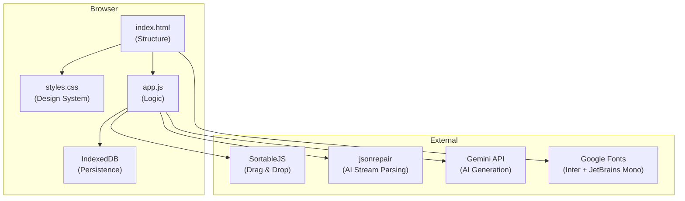
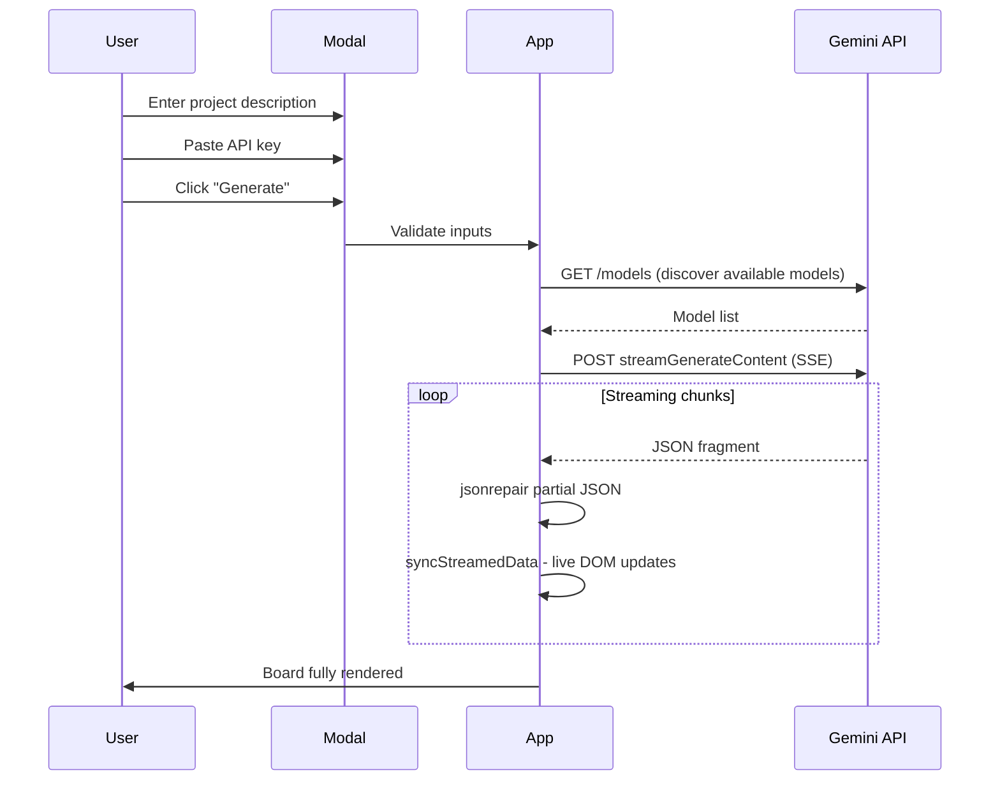
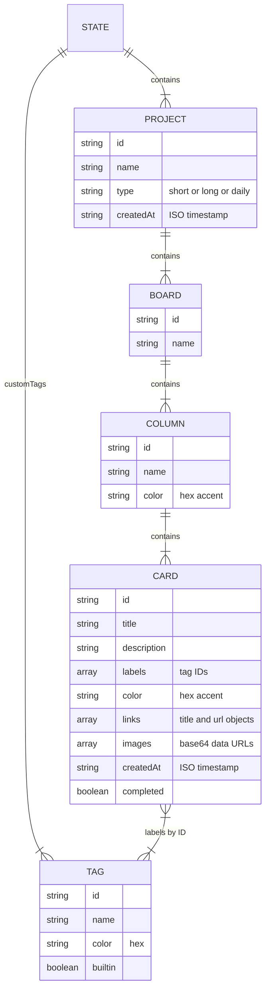

# KanbanFlow — Documentation

> **Version:** 2.0  
> **Last Updated:** July 2, 2026  
> **Stack:** Vanilla HTML / CSS / JavaScript · IndexedDB · SortableJS · Gemini AI

---

## Table of Contents

1. [Overview](#overview)
2. [Screenshots](#screenshots)
3. [Project Structure](#project-structure)
4. [Getting Started](#getting-started)
5. [Architecture](#architecture)
6. [Features](#features)
   - [Project & Board Management](#project--board-management)
   - [Task Cards](#task-cards)
   - [Drag & Drop](#drag--drop)
   - [Tag System](#tag-system)
   - [Search & Filtering](#search--filtering)
   - [AI Board Generation](#ai-board-generation)
   - [Today's Tasks](#todays-tasks)
   - [Import / Export](#import--export)
   - [Image Attachments](#image-attachments)
   - [Settings Panel](#settings-panel)
7. [Design System](#design-system)
8. [Data Model](#data-model)
9. [AI Integration](#ai-integration)
10. [Keyboard Shortcuts](#keyboard-shortcuts)
11. [Build & Deployment](#build--deployment)
12. [Browser Compatibility](#browser-compatibility)

---

## Overview

**KanbanFlow** is a local-first, privacy-focused Kanban board application. All data lives entirely in your browser via IndexedDB — no accounts, no servers, no tracking. It features AI-powered board generation using Google Gemini, a neon-accented dark theme, drag-and-drop task management, and a temporary "Today's Tasks" daily planner.

<!-- Screenshot: Full app overview showing sidebar + board -->


---

## Screenshots


### Main Board View
<!-- Screenshot: A board with multiple columns and cards -->


### Sidebar & Project List
<!-- Screenshot: Sidebar showing project list, daily tasks button, AI button -->


### Task Dialog
<!-- Screenshot: The task dialog open with Details tab active -->


### AI Generation Model
<!-- Screenshot: The AI modal with prompt text and long-term toggle -->


### AI Loading Animation
<!-- Screenshot: The orbital loading animation during AI generation -->


### Today's Tasks Board
<!-- Screenshot: A daily board with timer badge and crimson accent -->


### Settings & Tag Manager
<!-- Screenshot: Settings panel open with tag manager visible -->


### Long-Term Project Dashboard
<!-- Screenshot: Dashboard grid view for a multi-week project -->


---

## Project Structure

```
kan ban ai 3.o/
├── dist/                    # Production build output
│   ├── index.html           # Cache-busting params stripped
│   ├── styles.css
│   ├── app.js
│   ├── default_project.js
│   ├── favicon.ico
│   ├── logo-32.png
│   ├── logo-48.png
│   ├── logo-512.png
│   └── logo.svg
│
├── index.html               # Main entry point (400 lines)
├── styles.css               # All styling (1,401 lines)
├── app.js                   # Application logic (2,333 lines)
├── default_project.js       # Seed data — "Open Source Odyssey" project
├── build.js                 # Simple copy-based build script
│
├── favicon.ico              # Browser tab icon
├── logo-32.png              # Logo 32×32
├── logo-48.png              # Logo 48×48
├── logo-512.png             # Logo 512×512 (Apple Touch Icon)
├── logo.svg                 # Vector logo source
├── gen-logo.js              # Logo generation script (sharp)
│
├── package.json             # Dev deps: png-to-ico, sharp
└── node_modules/
```

| File | Size | Description |
|------|------|-------------|
| `index.html` | 22 KB | HTML structure — sidebar, modals, overlays, topbar |
| `styles.css` | 47 KB | Complete design system — dark theme, animations, responsive |
| `app.js` | 94 KB | All application logic — state, rendering, AI, drag-and-drop |
| `default_project.js` | 2.6 MB | Seed project with multi-week boards and populated cards |
| `build.js` | 1.5 KB | Copies files to `dist/`, strips cache-busting params |

---

## Getting Started

### Prerequisites

- A modern web browser (Chrome, Firefox, Edge, Safari)
- Node.js (only required for building `dist/`)

### Running Locally

Simply open `index.html` in a browser — no server required:

```bash
# Option 1: Direct file
start index.html

# Option 2: Local server (recommended for full features)
npx serve .
```

### Building for Production

```bash
node build.js
# Output: dist/ folder ready for deployment
```

### Deploying to Vercel

1. Set the **Output Directory** to `dist`
2. Set the **Framework Preset** to `Other`
3. Leave **Build Command** empty (or `node build.js`)
4. Deploy

---

## Architecture

KanbanFlow follows a simple, single-file architecture pattern:



### Key Principles

| Principle | Implementation |
|-----------|---------------|
| **Local-first** | All data in IndexedDB — no server, no accounts |
| **Zero build deps** | Vanilla JS/CSS — no framework, no bundler in production |
| **Single state tree** | One `state` object persisted atomically to IDB |
| **Immediate rendering** | All UI updates are synchronous DOM manipulation |
| **Progressive enhancement** | Works offline; AI features require network + API key |

---

## Features

### Project & Board Management

KanbanFlow organizes work into **Projects**, each containing one or more **Boards**.

<!-- Screenshot: Creating a new project via the input modal -->


#### Project Types

| Type | Description | Creation |
|------|-------------|----------|
| **Short-term** (`short`) | Single board, quick tasks | "New Board" button |
| **Long-term** (`long`) | Multiple weekly boards, dashboard view | "New Project" button |
| **Daily** (`daily`) | Temporary 24-hour board | "Generate Today's Tasks" button |

#### Actions

- **Create Project** — Opens input modal for project name; creates with dashboard grid
- **Create Board** — Creates standalone single-board project
- **Rename** — Inline editing via pencil icon (sidebar or topbar)
- **Delete** — Confirmation dialog; removes project and all boards/cards
- **Switch** — Click sidebar item to navigate

#### Long-Term Project Dashboard

<!-- Screenshot: Dashboard grid with board cards showing progress -->


Long-term projects display a **dashboard grid** instead of a single board. Each board appears as a card showing:
- Board name
- Progress bar (completed cards / total cards)
- Percentage completion
- Click to open that board

---

### Task Cards

Cards are the core unit of work in KanbanFlow.

<!-- Screenshot: A task card showing labels, description, and meta icons -->


#### Card Properties

| Property | Description |
|----------|-------------|
| **Title** | Required. Up to 200 characters |
| **Description** | Optional multi-line text. 2-line clamp on card, expands on hover |
| **Tags/Labels** | Zero or more tags from the tag system |
| **Accent Color** | Optional neon color bar on the left edge |
| **Links** | URL attachments with optional title |
| **Images** | Base64 image attachments (max 4 MB each) |
| **Completed** | Toggle via double-click or checkmark button |
| **Created At** | Auto-set timestamp |

#### Quick Add

Click the **"+ Add Card"** button at the bottom of any column to open an inline textarea. Press **Enter** to create, **Escape** to cancel.

<!-- Screenshot: Quick add textarea at bottom of column -->


#### Task Dialog

Single-click any card to open the full **Task Dialog** with three tabs:

| Tab | Contents |
|-----|----------|
| **Details** | Description, tag picker, color picker |
| **Links** | Add/remove URL links with titles |
| **Images** | Upload, paste, or drag-and-drop images; click to lightbox |

<!-- Screenshot: Task dialog with Images tab active -->


---

### Drag & Drop

Powered by [SortableJS](https://sortablejs.github.io/Sortable/).

<!-- Screenshot: Dragging a card between columns -->


| Action | Behavior |
|--------|----------|
| **Move cards** | Drag between columns or reorder within a column |
| **Reorder columns** | Drag column headers to rearrange |
| **Touch support** | 50ms delay to distinguish scroll from drag |
| **Animation** | 150ms card transitions, 200ms column transitions |

---

### Tag System

Tags provide visual categorization for cards.

<!-- Screenshot: Tag manager with built-in and custom tags -->


#### Built-in Tags (8)

| Tag | Color |
|-----|-------|
| 🔴 Bug | `#ff4f6f` |
| 🔵 Feature | `#00e5ff` |
| 🟣 Design | `#b87eff` |
| 🟡 Docs | `#ffb547` |
| 🟢 Infra | `#00ffb3` |
| 🩷 UX | `#ff4fcd` |
| 💙 Research | `#4f9fff` |
| 🟣 Review | `#7c6fff` |

Built-in tags cannot be deleted.

#### Custom Tags

- Create via Settings → Manage Tags
- Choose from 8 neon color swatches
- Duplicate names are rejected
- Deleting a tag removes it from all cards across all projects
- AI-generated boards can auto-create custom tags

---

### Search & Filtering

<!-- Screenshot: Search bar with results filtered, showing column counts -->


| Feature | Behavior |
|---------|----------|
| **Search** | Filters cards by title and description (case-insensitive) |
| **Tag Filter** | Toggle tag chips to show only cards with selected tags |
| **Combined** | Search + tag filter work together (AND logic) |
| **Column Counts** | Update to show `filtered / total` when filtering |
| **Clear** | "×" button or "Clear" chip resets all filters |

---

### AI Board Generation

KanbanFlow integrates with **Google Gemini** to generate complete boards from natural language descriptions.

<!-- Screenshot: AI modal with a project brief entered -->


#### How It Works



#### Generation Modes

| Mode | Toggle | Output |
|------|--------|--------|
| **Standard** | Default | Single board with columns and tasks |
| **Long-term** | "This is a long-term project" switch ON | Multiple weekly boards with day-based columns |
| **Daily** | Via "Generate Today's Tasks" button | Single board optimized for today's schedule |

#### Live Streaming

The AI response streams in real-time. As JSON fragments arrive:
1. `jsonrepair` reconstructs valid JSON from partial data
2. `syncStreamedData()` incrementally builds the board in the DOM
3. New columns slide in, cards pop in with animation
4. Tags are auto-created if they don't exist

#### Loading Animation

<!-- Screenshot: The orbital loading animation with typed status text -->


The loading screen features:
- Rotating orbital rings
- Animated dot grid
- Typewriter status text cycling through 6 phases
- Chip bubbles showing words from the AI response
- Progress step dots
- Cancel button

#### Retry Logic

- Up to 10 automatic retries on network failures
- 60-second delay between retries
- No retry on HTTP 400 (bad request)
- Abort on user cancellation

---

### Today's Tasks

A specialized AI feature for daily planning.

<!-- Screenshot: Today's Tasks board with timer badge -->


#### Behavior

| Aspect | Detail |
|--------|--------|
| **Creation** | "Generate Today's Tasks" button (sidebar, crimson `#CF0F47` accent) |
| **Visibility** | Button only appears when no daily board exists |
| **Prompt** | User enters schedule, appointments, priorities, habits |
| **AI Output** | Board with columns like "🔥 Must Do", "📋 Should Do", etc. |
| **Expiry** | Auto-deletes after 24 hours (checked on load + render) |
| **Timer Badge** | Shows remaining hours (e.g., "18h left") in sidebar |
| **Position** | Always sorted to the top of the project list |
| **Deletion** | Manual delete shows the "Generate" button again |
| **Limit** | Only one daily board can exist at a time |

---

### Import / Export

<!-- Screenshot: Import confirmation dialog -->


#### Export

- Downloads entire state as `kanbanflow-YYYY-MM-DD.json`
- Includes all projects, boards, cards, custom tags, and image data
- Click **Export JSON** in the sidebar footer

#### Import

- Accepts `.json` files via file picker
- Supports two formats:
  - **Modern** (`{ projects: [...] }`) — imports as full projects
  - **Legacy** (`{ boards: [...] }`) — wraps each board in a new project
- **Tag Mapping**: Deduplicates tags by name; remaps imported card labels to existing tag IDs
- **ID Regeneration**: All imported entities receive new unique IDs to prevent collisions
- **Confirmation**: Shows dialog with project/board count before merging
- Confirmation button says **"Import"** (blue) instead of "Delete" (red)

---

### Image Attachments

<!-- Screenshot: Image grid in task dialog with overlay controls -->


| Method | Description |
|--------|-------------|
| **File picker** | Click "Choose Files" button |
| **Click area** | Click the upload zone |
| **Drag & drop** | Drop images onto the upload area |
| **Clipboard paste** | Ctrl+V / Cmd+V while dialog is open |

- Images stored as base64 data URLs in IndexedDB
- Maximum file size: **4 MB** per image
- Click any image to open **lightbox** (full-screen viewer)
- Delete via overlay button on hover

---

### Settings Panel

<!-- Screenshot: Full settings panel with all sections visible -->


Opened via the **gear icon** in the sidebar header.

#### Sections

| Section | Contents |
|---------|----------|
| **Manage Tags** | View/create/delete custom tags |
| **AI Integration** | Provider selector (Gemini / Claude), API key inputs, Save button |
| **Storage** | IndexedDB status, data size, project count, tag count, total cards |
| **Danger Zone** | "Clear All Data" — permanently erases everything |

---

## Design System

### Color Palette

#### Background Scale
| Token | Hex | Usage |
|-------|-----|-------|
| `--bg-base` | `#080e1e` | Page background |
| `--bg-surface` | `#0d1630` | Board area background |
| `--bg-card` | `#111d3a` | Card background |
| `--bg-card-hover` | `#162040` | Card hover state |
| `--bg-sidebar` | `#09112a` | Sidebar background |
| `--bg-overlay` | `rgba(5,10,24,0.88)` | Modal backdrop |
| `--bg-input` | `#0d1835` | Input field background |
| `--bg-topbar` | `#09112aee` | Top bar (with transparency) |
| `--bg-settings` | `#0b1428` | Settings panel |

#### Neon Accents
| Token | Hex | Usage |
|-------|-----|-------|
| `--neon-cyan` | `#00e5ff` | Primary accent |
| `--neon-purple` | `#b87eff` | AI features |
| `--neon-pink` | `#ff4fcd` | Highlights |
| `--neon-amber` | `#ffb547` | Warnings |
| `--neon-mint` | `#00ffb3` | Success |
| `--neon-blue` | `#4f9fff` | Info |
| `--neon-red` | `#ff4f6f` | Danger |
| `--neon-indigo` | `#7c6fff` | Secondary |

#### Special Colors
| Color | Hex | Usage |
|-------|-----|-------|
| Daily Tasks accent | `#CF0F47` | "Generate Today's Tasks" button |

#### Text Colors
| Token | Hex | Usage |
|-------|-----|-------|
| `--text-primary` | `#e8f0ff` | Headings, card titles |
| `--text-secondary` | `#7a90b8` | Body text, descriptions |
| `--text-muted` | `#3e5080` | Placeholders, disabled |

### Typography

| Font | Usage |
|------|-------|
| **Inter** (300–700) | All UI text |
| **JetBrains Mono** (400–700) | Monospace elements, logo |

### Spacing & Sizing

| Token | Value |
|-------|-------|
| `--radius-sm` | 6px |
| `--radius-md` | 10px |
| `--radius-lg` | 14px |
| `--radius-xl` | 20px |
| `--sidebar-width` | 240px |
| `--column-width` | 300px |
| `--topbar-height` | 60px |

### Animations

| Animation | Duration | Usage |
|-----------|----------|-------|
| `slide-in-left` | 0.35s | Settings panel entrance |
| `modal-pop` | 0.25s | Modal scale-in |
| `fade-in` | 0.2s | Overlay fade |
| `toast-in` / `toast-out` | 0.3s | Toast notifications |
| `shake` | 0.4s | Input validation error |
| `popIn` | 0.3s | New card appearance |
| `slideDown` | 0.3s | New column appearance |
| `rotate-cw` / `rotate-ccw` | 12s/18s | AI loading orbital rings |
| `pulse-ring` | 2s | AI loading ring pulse |
| `blink` | 0.8s | Cursor blink in AI loading |

### Responsive Breakpoints

| Breakpoint | Behavior |
|------------|----------|
| `> 700px` | Sidebar docked, full layout |
| `<= 700px` | Sidebar becomes slide-out overlay, search input shrinks |

---

## Data Model

### State Shape

```javascript
{
  projects: [Project],       // All projects
  activeProjectId: string,   // Currently selected project ID
  activeBoardId: string,     // Currently selected board ID
  customTags: [Tag],         // User-created tags
  aiApiKey: string,          // Saved Gemini API key
}
```

### Entity Schemas



### Persistence

| Aspect | Detail |
|--------|--------|
| **Engine** | IndexedDB |
| **Database** | `UserData` |
| **Store** | `appState` |
| **Key** | `state` |
| **Debounce** | 100ms after last mutation |
| **Error handling** | Shows toast on `QuotaExceededError` |
| **Seed data** | `default_project.js` loaded when IDB is empty |

---

## AI Integration

### Supported Providers

| Provider | Model | Status |
|----------|-------|--------|
| **Google Gemini** | Flash (auto-detected) | Primary |
| **Anthropic Claude** | Haiku | UI exists, integration partial |

### API Key Management

- Keys can be set in the **AI Generator Modal** (per-generation) or **Settings Panel** (persisted)
- Stored in the `state.aiApiKey` field in IndexedDB
- Never sent to any server other than the AI provider

### Prompt Engineering

The AI receives a structured system instruction specifying:

1. **Output format** — Strict JSON schema (board name, columns, tasks, tags)
2. **Constraints** — Must use realistic task names, no placeholders, balanced column distribution
3. **Mode-specific rules**:
   - **Standard**: Single board with 3-5 columns
   - **Long-term**: Multi-board with weekly/daily breakdown
   - **Daily**: Schedule-aware with priority-based columns ("Must Do", "Should Do", "Nice to Have")

### Streaming Pipeline

```
Gemini SSE -> chunk accumulator -> jsonrepair() -> syncStreamedData() -> live DOM
```

---

## Keyboard Shortcuts

| Key | Context | Action |
|-----|---------|--------|
| **Escape** | Lightbox open | Close lightbox |
| **Escape** | Input modal open | Cancel and close |
| **Escape** | Task dialog open | Close dialog |
| **Escape** | Confirm dialog open | Cancel confirmation |
| **Enter** | Input modal focused | Submit value |
| **Enter** | Quick-add textarea | Create card |
| **Enter** | Column rename | Save name |
| **Escape** | Quick-add textarea | Cancel |
| **Escape** | Column rename | Revert name |

---

## Build & Deployment

### Build Process

The build script (`build.js`) performs a simple file copy:

```
Source (root)  ->  dist/
  index.html     (cache-busting ?v= params stripped)
  styles.css
  app.js
  default_project.js
  favicon.ico
  logo-32.png
  logo-48.png
  logo-512.png
  logo.svg
```

**No minification, bundling, or transpilation** — the code ships as-is.

### Vercel Deployment

| Setting | Value |
|---------|-------|
| Framework Preset | `Other` |
| Output Directory | `dist` |
| Build Command | `node build.js` |
| Install Command | _(leave empty)_ |

---

## Browser Compatibility

| Browser | Support |
|---------|---------|
| Chrome 90+ | Full |
| Firefox 90+ | Full |
| Edge 90+ | Full |
| Safari 15+ | Full |
| Mobile Chrome | Full (touch drag-and-drop) |
| Mobile Safari | Full |

### Required APIs

- `IndexedDB` — data persistence
- `Fetch` + `ReadableStream` — AI streaming
- `FileReader` — image upload
- `Clipboard API` — paste-to-upload
- `AbortController` — cancellable AI requests
- `CSS Custom Properties` — theming
- `backdrop-filter` — glass blur effects

---

## External Dependencies

| Library | Version | CDN | Purpose |
|---------|---------|-----|---------|
| SortableJS | 1.15.2 | jsDelivr | Drag-and-drop for cards and columns |
| jsonrepair | 3.4.0 | jsDelivr | Repairs malformed JSON from AI streaming |
| Inter | — | Google Fonts | Sans-serif UI font |
| JetBrains Mono | — | Google Fonts | Monospace font |

### Dev Dependencies (package.json)

| Package | Purpose |
|---------|---------|
| `sharp` | Logo PNG generation from SVG |
| `png-to-ico` | Favicon `.ico` generation |

---

> **Built with love — KanbanFlow is 100% local, 100% private, and 100% yours.**
